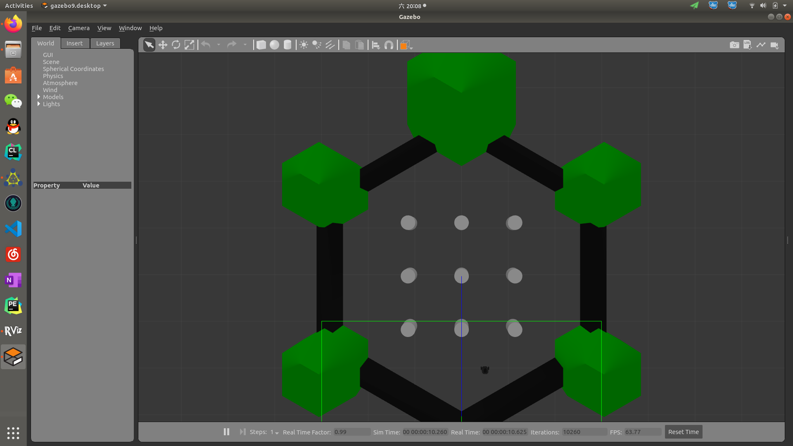

# costmap_2d 使用实例
costmap_2d的wiki文档很晦涩，对应的github实例又不是那么容易跑起来。经过几天辛苦耕耘之后，终于实现了turtlebot3_navigation包中效果。
> turtlebot3 burger / ubuntu 18.04 / ros melodic / 单机 / slam / rviz / costmap_2d

*整个ros package的核心其实在cfg文件夹中的.yaml文件*




## 使用方法
### 0. turtlebot3 simulation配置
turtlebot3配置参考[这里](https://emanual.robotis.com/docs/en/platform/turtlebot3/overview/)，确保`turtlebot3 navigation`板块下的代码能跑起来。

### 1. 创建ros目录，并编译
```
mkdir -p ~/catkin_ws/src
cd ~/catkin_ws
catkin_make
```
### 2. 修改~/.bashrc
打开文件
```
gedit ~/.bashrc
```
追加
```
source ~/catkin_ws/devel/setup.bash
```
### 3. 下载ros包
```
cd ~
git clone git@github.com:Vinson-sheep/ros_package.git
```
将ros_package中的`costmap_burger`文件夹复制到`~/catkin_ws/src`目录下。

### 4. 编译
```
cd ~/catkin_ws
catkin_make
```

### 7. 启动程序
```
roslaunch costmap_burger setup.launch
```

### 8. 远程控制
```
rosrun turtlebot3_teleop turtlebot3_teleop_key
```