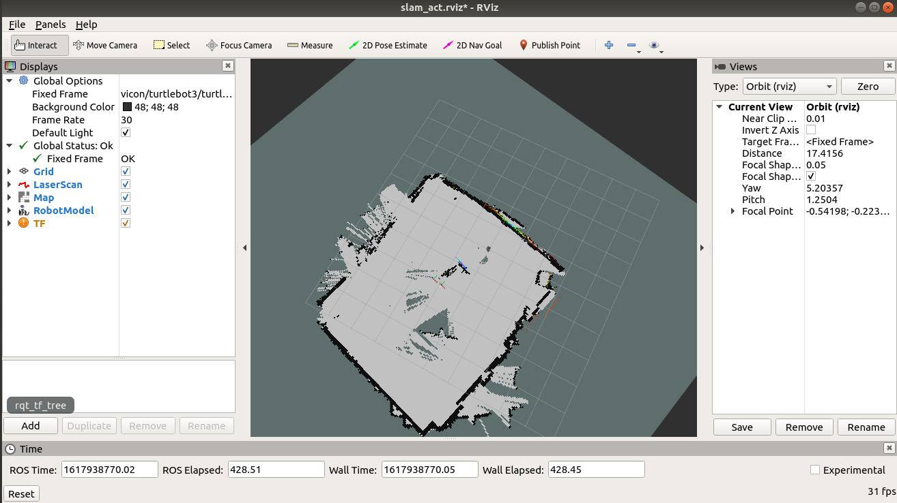
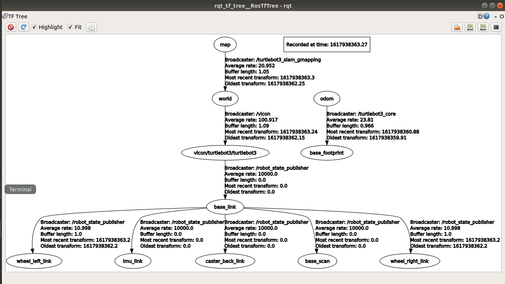

# turtlebot3 slam 上机
将turtlebot3的`base_footprint->odom`替换为vicon发布的`vicon/turtlebot3/turtlebot3->world`的转换帧，再进行slam建图。
> turtlebot3 burger / ubuntu 18.04 / ros melodic / 单机 / slam / rviz / vicon

*注意： 程序虽然能运行，但是存在bug。这个bug之所以存在是因为turtlebot3的里程计信息是二维的，而vicon的消息是三维。出于时间原因我还没修bug。*




turtlebot3配置参考[这里](https://emanual.robotis.com/docs/en/platform/turtlebot3/overview/)

vicon配置可以参考实验室说明文档，参考系设为`world`，刚体名字和所属组均设为`turtlebot3`。

## 使用方法
### 1. 创建ros目录，并编译
```
mkdir -p ~/catkin_ws/src
cd ~/catkin_ws
catkin_make
```
### 2. 修改~/.bashrc
打开文件
```
gedit ~/.bashrc
```
追加
```
source ~/catkin_ws/devel/setup.bash
```
### 3. 下载ros包
```
cd ~
git clone git@github.com:Vinson-sheep/ros_package.git
```
将ros_package中的`slam_act`文件夹复制到`~/catkin_ws/src`目录下。


### 4. 下载依赖包（如果报错请issue我）
```
sudo apt install ros-melodic-gmapping
// 可选(地图服务)
sudo apt install ros-melodic-map-server
```

### 5. 编译
```
cd ~/catkin_ws
catkin_make
```

### 6. 启动turbot3
开启turbot3电源
```
# 远程pc：启动ros master
roscore

# 远程pc：新建一个终端，然后ssh连接
ssh <username>@<IP of turbot3>
# 输入密码后，执行
roslaunch turtlebot3_bringup turtlebot3_robot.launch
```

### 7. 启动slam
```
roslaunch slam_act startup.launch
```

### 6. 启动远程操控
```
roslaunch slam_act teleop.launch
```

### 7. 保存地图(可选)
```
roslaunch slam_act map_save.launch
```