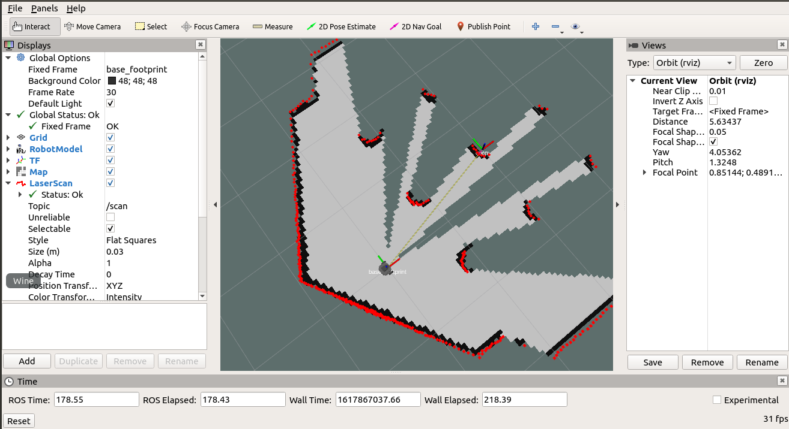

# turtlebot3 slam 模拟
launch文件均是参考官方源码自己写的，实际上是功能上的一种合并。
> turtlebot3 burger / ubuntu 18.04 / ros melodic / 单机 / slam / rviz / gazebo




## 使用方法
### 1. 创建ros目录，并编译
```
mkdir -p ~/catkin_ws/src
cd ~/catkin_ws
catkin_make
```
### 2. 修改~/.bashrc
打开文件
```
gedit ~/.bashrc
```
追加
```
source ~/catkin_ws/devel/setup.bash
```
### 3. 下载ros包
```
cd ~
git clone git@github.com:Vinson-sheep/ros_package.git
```
将ros_package中的`slam_sim`文件夹复制到`~/catkin_ws/src`目录下。


### 4. 下载依赖包（如果报错请issue我）
```
sudo apt install ros-melodic-gmapping
// 可选(地图服务)
sudo apt install ros-melodic-map-server
```

### 5. 编译及运行
```
cd ~/catkin_ws
catkin_make

roslaunch slam_sim startup.launch
```

有时候gazebo和rviz没有同时开启，这跟电脑性能有关，多退出launch终端重试几次就好了。

### 6. 启动远程操控
```
roslaunch slam_sim teleop.launch
```

### 7. 保存地图
```
roslaunch slam_sim map_save.launch
```