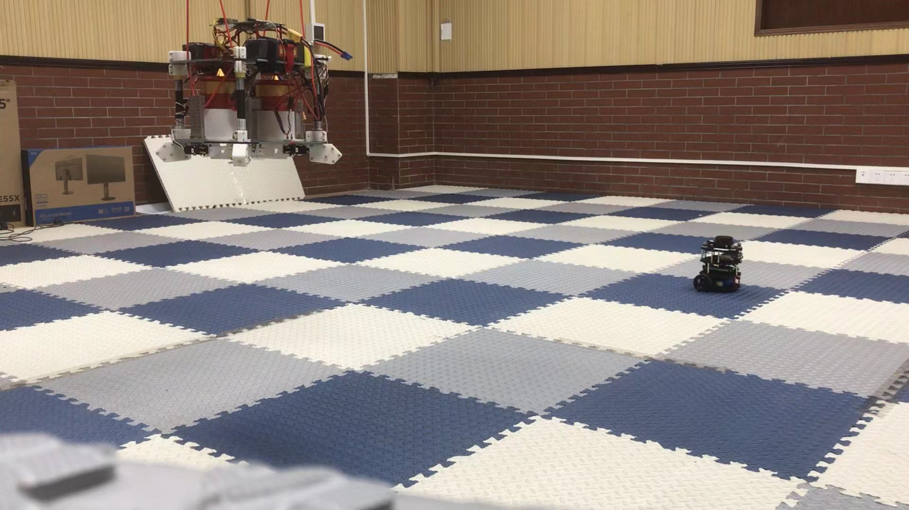
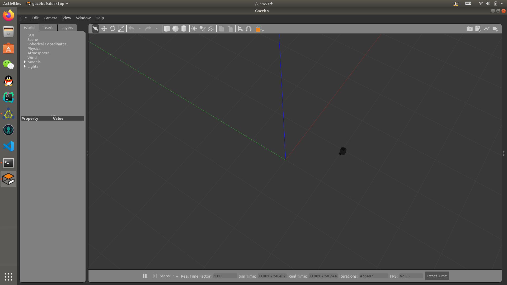

# turtlebot3 square run
控制turtlebot3走方阵。模拟和仿真都可以运行。

> turtlebot3 burger / ubuntu 18.04 / ros melodic / 单机 / gazebo /vicon





## gazebo仿真
### 1. 部署仿真环境
参考[turtlebot3官网](https://emanual.robotis.com/docs/en/platform/turtlebot3/overview/)

### 2. 创建ros目录，并编译
```
mkdir -p ~/catkin_ws/src
cd ~/catkin_ws
catkin_make
```
### 3. 修改~/.bashrc
打开文件
```
gedit ~/.bashrc
```
追加
```
source ~/catkin_ws/devel/setup.bash
```
### 4. 下载ros包
```
cd ~
git clone git@github.com:Vinson-sheep/ros_package.git
```
将ros_package中的`square_run`文件夹复制到`~/catkin_ws/src`目录下。

### 5. 运行
```
roslaunch square_run run_sim.launch
```

## vicon上机

### 1. 部署上机环境
参考[turtlebot3官网](https://emanual.robotis.com/docs/en/platform/turtlebot3/overview/)

### 2. 启动vicon tracker
打开地面站的vicon tracker，设置turtlebot3刚体。组名和对象名设置为`turtlebot3`。

### 3. 启动turtlebot3
在remote pc打开一个新终端
```
roscore
```
再在remote pc打开一个新终端
```
ssh up-1@192.168.1.10
(输入密码后)
roslaunch turtlebot3_bringup turtlebot3_robot.launch
```
此时turtlebot3已经可以被控制了。

### 4. 创建ros目录，并编译
```
mkdir -p ~/catkin_ws/src
cd ~/catkin_ws
catkin_make
```
### 5. 修改~/.bashrc
打开文件
```
gedit ~/.bashrc
```
追加
```
source ~/catkin_ws/devel/setup.bash
```
### 6. 下载ros包
```
cd ~
git clone git@github.com:Vinson-sheep/ros_package.git
```
将ros_package中的`square_run`文件夹复制到`~/catkin_ws/src`目录下。

### 7. 运行
```
roslaunch square_run run_act.launch
```
