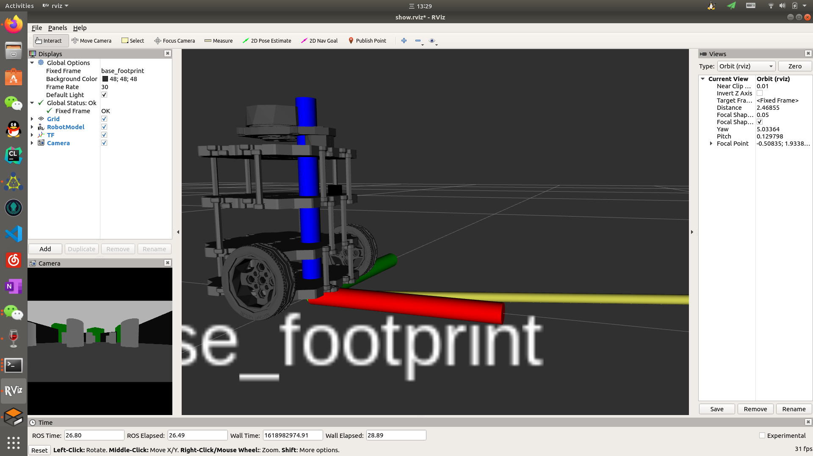
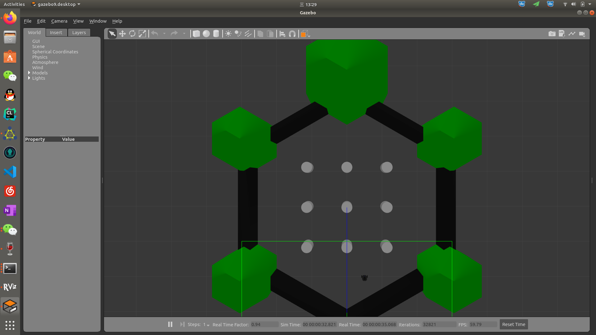

# turtlebot3 model with monocular camera
在官方turtlebot3 burger模型上添加了一个前向单目摄像头，供大家使用。launch的demo已经给出，只需按照教程就能使用。

> turtlebot3 burger / ubuntu 18.04 / ros melodic / 单机 / gazebo / camera





## 快速体验
### 1. 部署仿真环境
假设你安装了`ubuntu 18.04`、`ros melodic`。

### 2. 创建ros目录，并编译
```
mkdir -p ~/catkin_ws/src
cd ~/catkin_ws
catkin_make
```
### 3. 修改~/.bashrc
打开文件
```
gedit ~/.bashrc
```
追加
```
source ~/catkin_ws/devel/setup.bash
```
### 4. 下载ros包
```
cd ~
git clone git@github.com:Vinson-sheep/ros_package.git
```
将ros_package中的`turtlebot3_model_cam`文件夹复制到`~/catkin_ws/src`目录下。

### 5. 运行
```
roslaunch turtlebot3_model_cam startup.launch
```

## 移植指定项目
### 1. 复制模型文件
turtlebot3 burger模型的核心文件包括`meshes文件夹`、`urdf文件夹`。将这两个文件夹复制到你的目标包目录下。

### 2. 修改路径
假设你的目标包名为`your_pkg`。打开`urdf`目录下的`turtlebot3_burger.urdf.xacro`文件，将所有`turtlebot3_model_cam`替换为`your_pkg`。

### 3. 在launch文件中调用
参考源文件中`setup.launch`的写法。

## 可能出现的问题
**问题描述:**

在xml类文件(urdf,xacro等)中，添加中文注释后，roslaunch运行出现以下报错:

> UnicodeEncodeError: ‘ascii’ codec can’t encode characters in position xxx ordinal

**解决方案:**
在目录/opt/ros/kinetic/lib/python2.7/dist-packages下，新建一个sitecustomize.py文件，内容为：
```
#coding=utf8
import sys
reload(sys)
sys.setdefaultencoding('utf8')
```